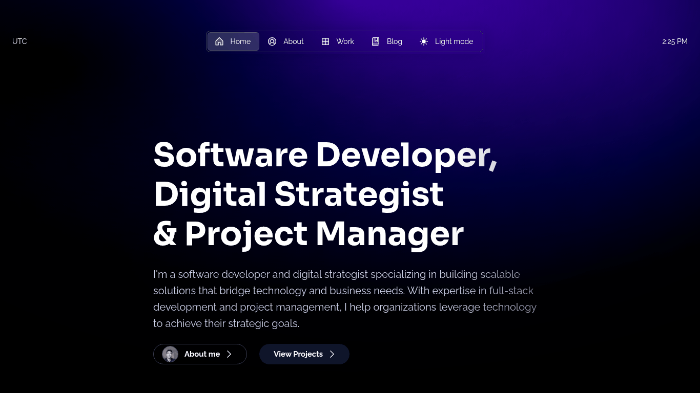

# ✨ Welcome to My Portfolio

Hi, I'm **Mujtaba Rizvi**, a passionate front-end developer with a love for creating beautiful, functional, and user-centric web experiences. This repository contains the source code for my personal portfolio website.

### 🌐 **View Live Site**

---

  <p align="center">
    
  </p>

## 🚀 About This Project

This portfolio is more than just a list of projects; it's a project in itself. It's a fully-featured, responsive, and performant website built from the ground up to showcase my skills in modern web development.

### Key Features

- **Elegant & Responsive Design:** Built with a mobile-first approach to ensure a seamless experience on all devices, from phones to desktops.
- **Performant:** Optimized for speed with Next.js static site generation, image optimization, and Vercel's Speed Insights.
- **SEO Optimized:** Automatic generation of metadata, schemas, and Open Graph images to ensure excellent search engine visibility.
- **MDX-Powered Content:** Blog posts and project case studies are written in MDX, allowing for a rich mix of Markdown and interactive React components.

## 🛠️ Tech Stack

This project was built using a modern and robust set of technologies:

- **Framework:** Next.js (React)
- **Styling:** Sass, PostCSS, and Once UI for a consistent design system.
- **Animation:** Framer Motion for smooth, subtle animations.
- **Content:** MDX for blog posts and project details.
- **Deployment:** Vercel with integrated Analytics and Speed Insights.

## ⚙️ Running Locally

If you'd like to explore the code or run this project on your local machine, follow these steps:

1.  **Clone the repository:**

    ```bash
    git clone https://github.com/mujtaba-r/magic-portfolio.git
    cd magic-portfolio
    ```

2.  **Install dependencies:**

    ```bash
    npm install
    ```

3.  **Run the development server:**

    ```bash
    npm run dev
    ```

    The site will be available at `http://localhost:3000`.

## 🤝 Connect With Me

I'm always open to connecting with other developers, designers, and potential collaborators. Feel free to reach out!

- **LinkedIn:** https://www.linkedin.com/in/mujtabahassanrizvi
- **GitHub:** @mujtaba-r
- **X (Twitter):** @MujtabaRizvii

## 🙏 Acknowledgements

This portfolio was built using the fantastic **Magic Portfolio** template by the creators of Once UI. A huge thank you to them for providing such a great open-source starting point.

## 📄 License

The code in this repository is available under the **MIT License**.
